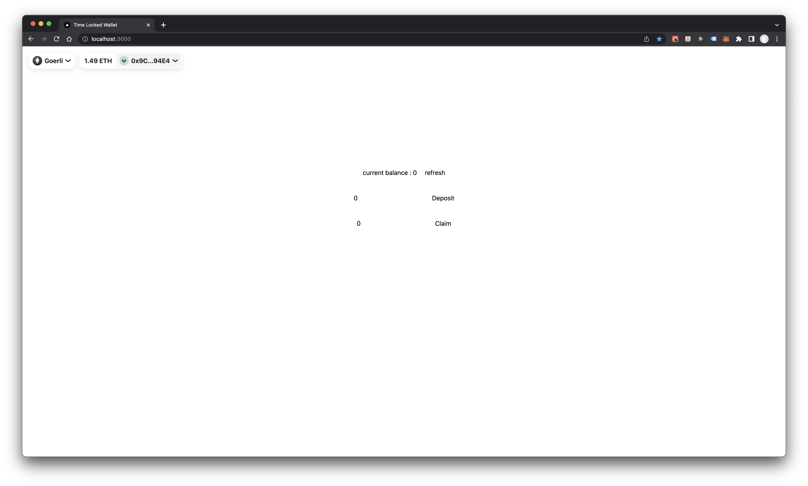

# TimeLockedWallet

A simple Dapp for locking ERC20 or ETH tokens in contract as per the lock time set in the contract by the owner.

## Quick Start Notes

### To run the Dapp

1. Run `yarn` to install all the dependencies
2. Run `yarn dev` to start your FrontEnd dev environment

### To Develop

2.  Run `yarn` to install all the dependencies
3.  Once installation is complete, `cd` into your app's directory and run `yarn chain` to start a local hardhat environment
4.  Open another terminal and `cd` into your app's directory
5.  Run `yarn deploy` to deploy the example contract locally
6.  Run `yarn dev` to start your FrontEnd dev environment
7.  Run `yarn test` to run tests of the smart contracts

## Technologies

This project is built with the following open source libraries, frameworks and languages. User choice of framework used, available in plain js or typescript.
| Tech | Description |
| --------------------------------------------- | ------------------------------------------------------------------ |
| ------ | ------ React Frontend Environment ------ |
| [Next JS](https://nextjs.org/) | React Framework |
| ------ | ------ CSS Framework ------ |
| none | |
| [Tailwind](https://tailwindcss.com/) | A utility-first CSS framework |
| ------ | ------ Ethereum Development Environment ------ |
| [Hardhat](https://hardhat.org/) | Ethereum development environment for professionals |
| ------ | ------ Included Libraries ------ |
| [WAGMI](https://wagmi.sh/) | A set of React Hooks for Web3 |
| [RainbowKit](https://www.rainbowkit.com/docs/introduction) | RainbowKit is a React library that makes it easy to add wallet connection to your dapp. |
